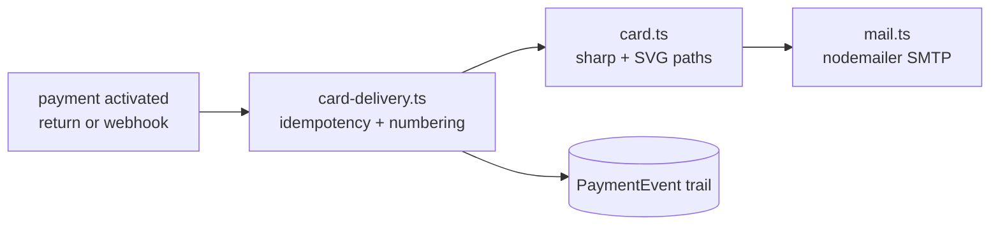

# CARD_GENERATOR.md

> **What is this?** How the personalized member card is generated and delivered, why it's built this way, and how to change it safely. The design source is the association's Illustrator file (`cardhonneur.ai`, two-sided).

## What a member receives

After a confirmed payment, an email (FR + AR) with two attachments:
- `carte-otjm-NNNN.png` — the personalized back side, for phone screens.
- `carte-otjm-NNNN.pdf` — two pages (front + back) at the artwork's physical size (~91.5 × 60 mm), for printing.

Personalized fields on the back: **card number** (zero-padded, inside the design's "CARTE N°" badge, replacing the placeholder `0162`), **member name** (maroon Trajan-style caps), **validity** ("Valable jusqu'au MM/YYYY" from `Membership.endDate`).

## Pipeline (and why each choice)

| Piece | File | Key decisions |
|---|---|---|
| Templates | `src/assets/card/card-template-{1,2}.png` | One-time 300-DPI rasterization of the .ai (via `pdftoppm` — the .ai is PDF-compatible). Re-rasterize only if the design changes. |
| Compositor | `src/lib/card.ts` | sharp composite of an SVG overlay. **Text is converted to vector paths with opentype.js** (fonts ship in `src/assets/card/fonts/`: Anton for digits, Cinzel for name — both OFL). No system-font dependency → byte-identical output on any server, no headless browser (ADR-004). |
| Geometry | `TEMPLATE` const in card.ts | Measured in template-2 pixel space (1082×709): badge patch x104 y510 278×118 fill `#381f21`; name centered cx730 baseline 512; validity baseline 552 (social-row divider is at y≈573 — don't go lower). |
| Numbering | `src/lib/card-delivery.ts` | Sequential `Membership.cardNumber` (unique index; max+1 with one retry on clash). Assigned once, never reused — matches the printed-number semantics of the design. |
| Idempotency | `Membership.cardSentAt` | return + webhook both fire on success; the first delivery wins, replays skip. Admin "resend" uses `force=true`. |
| Email | `src/lib/mail.ts` | nodemailer over SMTP, all coordinates in env (ADR-005). Unconfigured SMTP → delivery is *skipped and logged* (`PaymentEvent email_skipped`), never an error — payments must not depend on email health. |

## Operational notes

- **Env required for delivery:** `SMTP_HOST/PORT/USER/PASS`, `MAIL_FROM` (see `.env.example`). Until set, members pay and activate normally but receive no email; admins can send later with the ✉ button on the members page.
- **Standalone deploys:** `next.config.ts` `outputFileTracingIncludes` bundles `src/assets/card/**` into `.next/standalone` for the payment/membership routes. If you add a new route that generates cards, add it there too.
- **Visual regression check:** `node_modules\.bin\tsx scripts/sample-card.ts` writes `scripts/sample-card.png|pdf` — eyeball after any geometry/font change. Unit tests (`src/lib/__tests__/card.test.ts`) verify dimensions and that digits actually land on the badge.
- **DB sync:** `cardNumber`/`cardSentAt` fields + unique index need one `npx prisma db push` against the production `DATABASE_URL`.

## Known limits / how to extend

- The provided design is the **"Membre d'honneur"** variant (the badge pill and the Arabic title "عضو شرفي" are baked into the artwork). For tier-specific cards (Externe/Interne), get per-tier .ai exports from the designer, rasterize each to `card-template-2-<tier>.png`, and pick by `membership.tier` in `card.ts` — the overlay logic doesn't change.
- Latin-script personalization only: opentype.js does not do Arabic shaping; the Arabic on the card is part of the static artwork (already correctly shaped). If Arabic *names* are ever needed, swap path generation for a shaping-aware renderer (e.g. harfbuzzjs) — isolated inside `centeredTextPath()`.
- Cards are generated on demand and never stored — no PII-bearing files at rest; regenerate any time from DB state.
