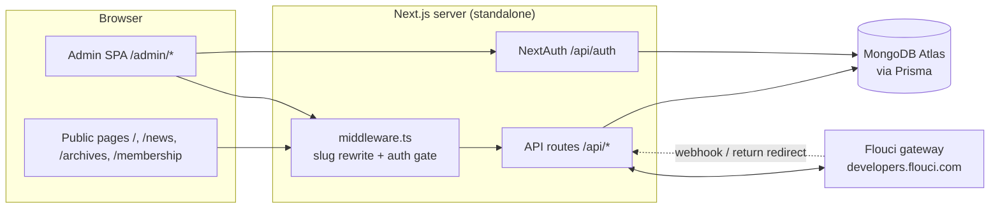
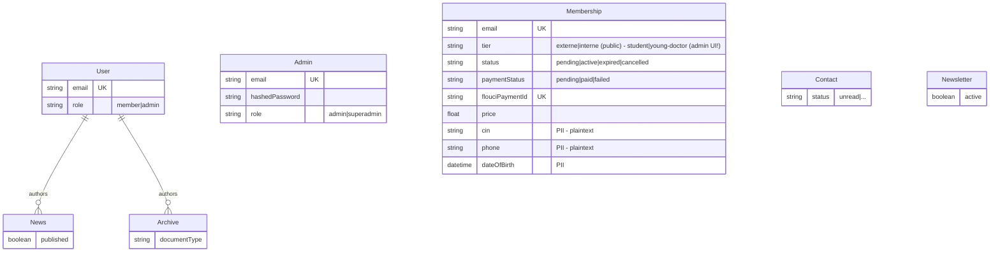
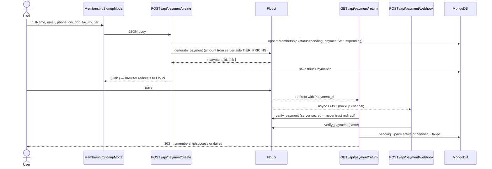

# PROJECT_ARCHITECTURE.md

> **What is this?** The complete architectural map of the OTJM platform: routes, data model, payment flow, auth flow, i18n. Written so a new engineer can navigate the codebase in under an hour.
> **Last audited:** 2026-06-12 (commit `675fabc`)

## 1. What the system is

OTJM (Organisation Tunisienne des Jeunes Médecins) is a membership platform for a Tunisian medical association:

- **Public site** — homepage, news, archives, membership signup with online payment (Flouci), privacy policy. Bilingual FR/AR with RTL support.
- **Admin panel** — hidden behind a secret URL slug, manages members, news, archives, admin users, contacts, newsletter subscribers.

**Stack:** Next.js 15 (App Router) · React 19 · TypeScript · Tailwind 4 + shadcn/ui · Prisma 6 + MongoDB Atlas · NextAuth (credentials/JWT) · Flouci payment gateway · deployed as `output: 'standalone'`.

> A Laravel/PostgreSQL rewrite is planned long-term (see `FIX.md` and root `CLAUDE.md`), but **this Next.js codebase is the production system today** and is what these docs describe.

## 2. High-level component diagram

## 3. Route inventory

### Public pages
| Path | Purpose | Key file |
|---|---|---|
| `/` | Hero landing, latest news, membership CTA | `src/app/page.tsx` (863 lines, monolithic client component) |
| `/news` | News list with filters/search | `src/app/news/page.tsx` |
| `/archives` | Historical documents | `src/app/archives/page.tsx` |
| `/membership` | Signup wizard → pricing → modal form | `src/app/membership/page.tsx` + `src/components/otjm/MembershipSignupModal.tsx` |
| `/membership/success` `/membership/failed` | Post-payment landing | `src/app/membership/{success,failed}/page.tsx` |
| `/privacy` | RGPD policy | `src/app/privacy/page.tsx` |
| `/setup` | First-admin bootstrap form | `src/app/setup/page.tsx` |

### Admin pages (middleware-protected, reached via `/{ADMIN_SLUG}` rewrite)
| Path | Purpose |
|---|---|
| `/admin` | Login form (NextAuth credentials) |
| `/admin/dashboard` | Stats overview |
| `/admin/members` | Membership CRUD + XLSX bulk import |
| `/admin/users` | Admin user CRUD |
| `/admin/news` / `/admin/archives` | Content CRUD |

### API routes
| Route | Methods | Auth | Rate limit | Models |
|---|---|---|---|---|
| `/api/auth/[...nextauth]` | * | — (is the auth endpoint) | — | Admin, User |
| `/api/payment/create` | POST | public | 5/60s | Membership |
| `/api/payment/return` | GET | public | — | Membership |
| `/api/payment/webhook` | POST | public | — | Membership |
| `/api/contact` | POST public / GET admin | mixed | 5/60s | Contact |
| `/api/newsletter` | POST public / GET admin | mixed | 5/60s | Newsletter |
| `/api/news`, `/api/news/[id]` | GET public / POST PATCH DELETE admin | mixed | — | News |
| `/api/archives`, `/api/archives/[id]` | GET public / POST PATCH DELETE admin | mixed | — | Archive |
| `/api/membership`, `/api/membership/[id]` | GET POST PATCH DELETE | admin | — | Membership |
| `/api/membership/bulk-import` | POST | admin | — | Membership |
| `/api/admin/users`, `/api/admin/users/[id]` | GET POST PATCH DELETE | admin | — | User/Admin |
| `/api/setup` | POST | **public (one-shot bootstrap)** | — | Admin |

> ⚠️ **Known critical bug:** `src/middleware.ts:6` `PUBLIC_API` whitelist omits `/api/payment` and the public branch of `/api/membership`. In production (`NODE_ENV !== 'development'` — the middleware short-circuits in dev) every payment call and Flouci webhook receives **401**, so the public signup flow is broken in prod. See `SECURITY_REVIEW.md` and `TECHNICAL_DEBT.md`.

## 4. Data model (Prisma → MongoDB)

Key facts:
- **`Admin` and `User` are separate collections.** `Admin` holds credentials; on each successful login, `authorize()` upserts a mirror `User` row so News/Archives can have an author relation (`src/app/api/auth/[...nextauth]/options.tsx`).
- **`Membership` is standalone** — no relation to `User`. Members never log in; they exist only as records.
- **PII (cin, phone, dateOfBirth) is stored in plaintext.** Encryption at rest is a planned improvement (the Laravel plan calls for application-level encryption; the Next.js codebase has none).
- **Tier naming is inconsistent**: public signup writes `externe|interne` (from `TIER_PRICING` in `src/lib/flouci.ts`); the admin UI and the PATCH whitelist in `src/app/api/membership/[id]/route.ts` use `student|young-doctor`. Admin cannot round-trip a publicly created membership.

## 5. Payment flow (Flouci) — end to end

Design decisions already in place (keep these):
- **Price authority is server-side** — `TIER_PRICING` in `src/lib/flouci.ts`; the client never sends an amount.
- **Verify-don't-trust** — both `return` and `webhook` re-query Flouci with the secret key before mutating state.
- **Monotonic state** — transitions only run when `paymentStatus === 'pending'`; a paid row is never demoted.

Known gaps (see `TECHNICAL_DEBT.md` / improvement plan):
- No amount cross-check on verify (verify response amount vs `membership.price`).
- No payment-event audit log.
- No email/card delivery after success — the success page *promises* "vous recevrez votre carte membre par email" but no email library exists in the project at all.
- Webhook has no rate limit.
- The middleware 401 bug above blocks all of this in production.

## 6. Auth flow (admin)

1. Middleware rewrites `/{ADMIN_SLUG}/*` → `/admin/*` (slug from env; unknown visitors hitting `/admin` directly get **404** unless they carry an admin JWT — hides the panel's existence).
2. `/admin` renders the login form → NextAuth credentials provider → bcrypt compare against the `Admin` collection.
3. JWT session strategy; `role` and `id` are propagated into the token and session (typed in `types/next-auth.d.ts`).
4. Defense in depth: middleware gate (server) + `AdminGuard`/`AdminSessionProvider` (client) + `requireAdmin()` in API routes (`src/lib/auth.ts`).
5. **Dev bypass everywhere**: middleware, AdminGuard, AdminSessionProvider, and `requireAdmin()` all skip auth when `NODE_ENV === 'development'`. Convenient locally; means *no auth code path is exercised until production*.

First-admin bootstrap: `/setup` page → `POST /api/setup`, plus a legacy `createAdmin.js` CLI script at the repo root (duplicate mechanism — one should be removed).

## 7. i18n architecture

- **Custom context provider** in `src/lib/i18n.tsx` (461 lines): FR and AR dictionaries embedded as TS objects, `useLanguage()` hook returns `{ lang, setLang, t }`.
- Persisted in `localStorage('otjm-lang')`; provider sets `document.documentElement.lang/dir` (RTL for Arabic).
- `next-intl` is in package.json but **unused** — the custom provider is the real system.
- `src/components/otjm/LangSync.tsx` duplicates the provider's lang/dir effect (redundant).
- Coverage: UI fully FR/AR; contact/newsletter form labels are FR-only.

## 8. Where things live

| Concern | Location |
|---|---|
| DB client singleton | `src/lib/db.ts` |
| Flouci client + pricing | `src/lib/flouci.ts` |
| Auth helpers (`requireAdmin`) | `src/lib/auth.ts` |
| In-memory rate limiter | `src/lib/rate-limit.ts` (per-instance Map — resets on deploy, not multi-instance safe) |
| i18n provider + dictionaries | `src/lib/i18n.tsx` |
| Animation variants | `src/lib/animations.ts` |
| Shared constants | `src/lib/constants.ts` (incomplete — pricing/image defaults still hardcoded in pages) |
| Public site components | `src/components/otjm/` |
| shadcn primitives (vendored — don't hand-edit) | `src/components/ui/` |
| NextAuth type extensions | `types/next-auth.d.ts` |

## 9. How to extend

- **New public API route**: add the handler under `src/app/api/...`, and **remember to add its prefix to `PUBLIC_API` in `src/middleware.ts`** if it must be reachable without an admin session. This omission is exactly what broke payments.
- **New admin CRUD page**: today this means copying ~600 lines of an existing page; after the planned hook extraction (`useCrudApi`, `useModalForm`, `useTableFilter` — see `TECHNICAL_DEBT.md`), it should be a thin page composing those hooks.
- **New translation**: add the key to both `fr` and `ar` objects in `src/lib/i18n.tsx` — TypeScript enforces parity because `Translations = typeof fr`.
- **New membership tier**: change `TIER_PRICING` in `src/lib/flouci.ts` — and (until unified) the admin `PRICE_MAP` in `src/app/admin/members/page.tsx` and the PATCH whitelist in `src/app/api/membership/[id]/route.ts`. Unifying these into one constant is on the debt list.
