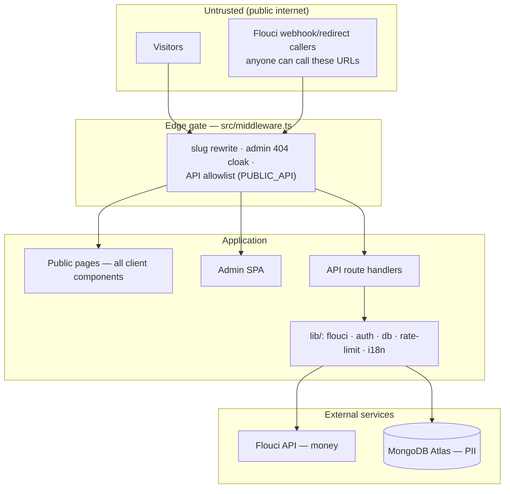

# SYSTEM_MAP.md

> **What is this?** A one-page leverage map: the moving parts, their trust boundaries, and where a change has the highest system-wide impact. Read `PROJECT_ARCHITECTURE.md` for detail; read this to decide *where to intervene*.
> **Last audited:** 2026-06-12

## Subsystems and trust boundaries

## The seven leverage points (highest first)

| # | Leverage point | Why it dominates | Current state |
|---|---|---|---|
| 1 | **`src/middleware.ts` PUBLIC_API allowlist** | One 6-entry array decides which features exist in production. It currently *silently disables payments*. | 🔴 Broken for `/api/payment/*` |
| 2 | **Payment state machine** (`pending→paid/failed` in return+webhook) | Money and membership truth flow through ~90 lines in 2 files. Any bug = real dinars. | 🟡 Sound logic, missing amount check, audit log, tests |
| 3 | **`TIER_PRICING` (lib/flouci.ts) as single price authority** | Server-side pricing kills a whole class of price-tampering bugs — but a *second* price map exists in the admin page, so the "single" authority is currently dual. | 🟡 Needs unification into `lib/constants.ts` |
| 4 | **Admin CRUD pattern** (5 pages × ~600 lines of copy-paste) | Every future admin feature pays the duplication tax. Extracting 3 hooks changes the marginal cost of all future admin work. | 🟡 ~800 duplicated lines identified |
| 5 | **Client/server rendering split** | The homepage being one 863-line client component is why LCP suffers and why SEO sees an empty shell. Moving data fetching server-side fixes perf *and* SEO in one intervention. | 🟡 All public pages client-rendered |
| 6 | **Email capability (absent)** | Card delivery, payment confirmations, admin notifications, newsletter sends — four roadmap features block on one missing subsystem. | 🔴 Does not exist |
| 7 | **`NODE_ENV=development` bypasses** (middleware + 3 auth layers) | All security is untested until prod. The prod-only payment breakage shipped precisely because dev skips the middleware. | 🟡 Needs a "prod-mode local run" habit + tests |

## Information flows worth knowing

- **Money truth** lives at Flouci; our DB holds a *cached verdict* obtained via `verifyPayment()` (secret-key authenticated). Webhook payloads are treated as untrusted triggers, not as truth — correct design.
- **Membership truth** lives in MongoDB `Membership` (status × paymentStatus). Admin UI, payment callbacks, and bulk import all write to it — three writers, no audit trail.
- **Identity truth** for admins lives in the `Admin` collection; a shadow `User` row is upserted at login for content authorship. Two collections, one human — known wart.
- **Language state** lives in localStorage and React context only — server renders are language-blind (FR flash for AR users).

## Failure domains

| Domain | Blast radius | Mitigation today |
|---|---|---|
| MongoDB Atlas down | Whole site dynamic content + payments | None (no caching of public content) |
| Flouci down | New signups only — existing members unaffected | 502 surfaced to user; retry manually |
| In-memory rate limiter reset (every deploy/instance) | Brute-force window | Acceptable for current scale; revisit if multi-instance |
| Secret leakage (`.env`) | Full DB + payment credentials | `.env` gitignored; no secrets in repo (verified) |
